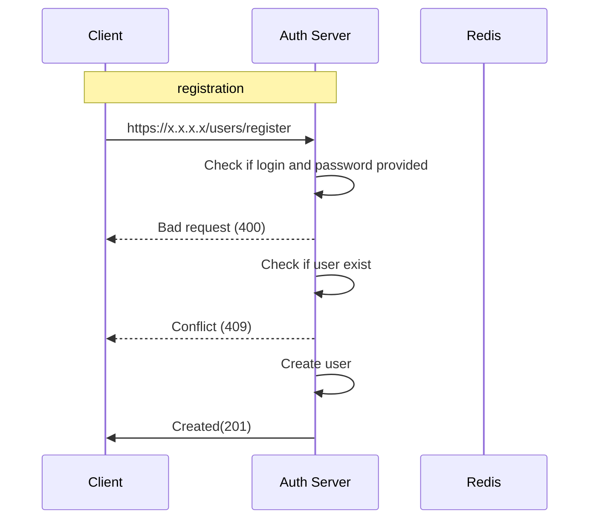

**Path**: /users/register
**Type**: Post  
**Body**:  
```
{
	"login": "",
	"password": ""
}  
```
**Response Body**
```
{
"Msg": "Object successfully created"
}
```
## Can be implemted in future - not done
**for storing data in BD we will use ciphering**
1. generate random key1
2. generate key2 from user password with PBKDF2
3. cipher user data with key1 and store in DB
4. cipher key1 with key2 and store result in DB for user (key3)

Each time user login we can generate key2 from user password with PBKDF2 (and same can do client)
Load from database key3 and decrypt with key2 -> key1
decrypt user data from database with key1
In case we need to send data to client, we can send key3 and encrypted data. Client based on password will genereate key2 decrypt key3->key1 and finally decrypt data

Each time user change password we need to load from DB key3, generate key2 from old password and decrypt key3->key1. 
Generate new key2 from new password. encrypt key1 with new key2 -> key3. update key3 in DB
