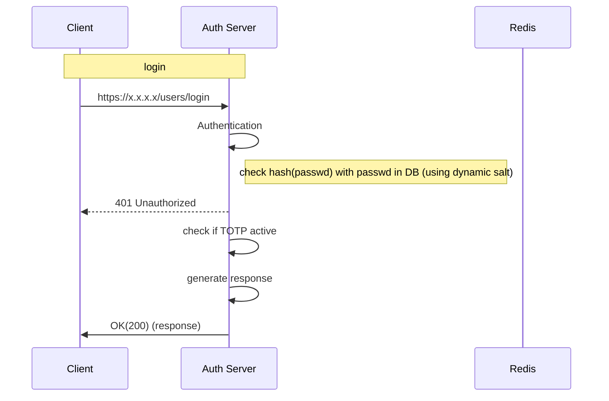

**Path**: /users/login
**Type**: Post  
**Body**:  
```
{
	"login": "",
	"password": ""
}  
```
**Response Body**:  
```
{
  "request_id": "string",
  "token": {
    "access_token": "string",
    "refresh_token": "string",
    "required_fields": [
      "string"
    ]
  },
  "totp_active": true
}  
```
