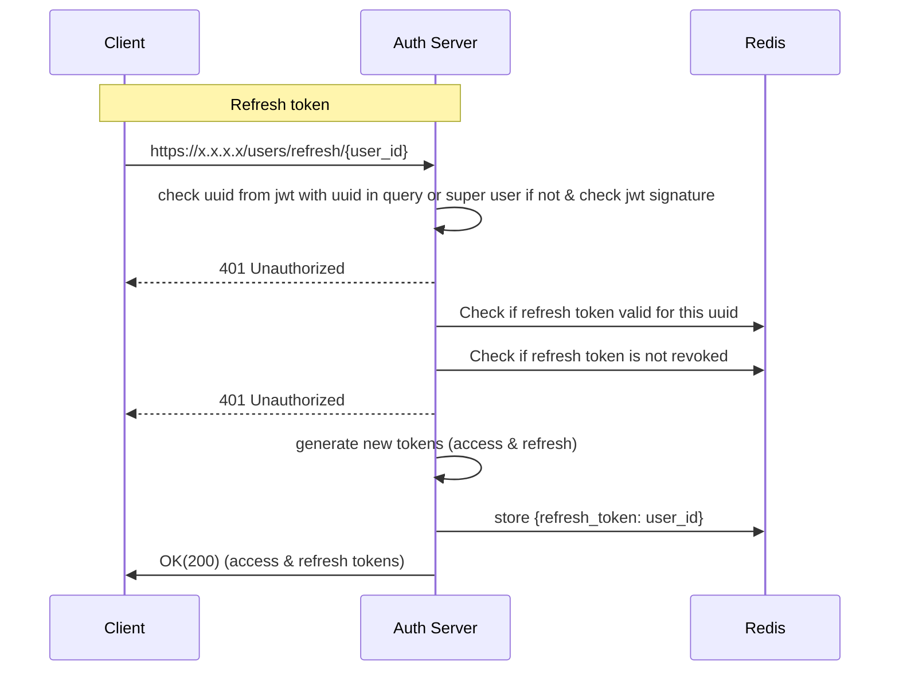

**Path**: /users/refresh/{user_id} 

**Type**: Get  
**Header**: Authorization: Bearer {token}  
**Body**: None  
**Response Body**:  
```
{  
	"access_id": "access_token",
	"refresh_id": "refresh_token"
}  
```

Token time to live 1 day
Token refresh time to live 10 days
**format of storing revoked tokens**
```
{
	"access_token_id": "timestamp",
	...
	"all": "timestamp" # if logout from all devices was done
}
```