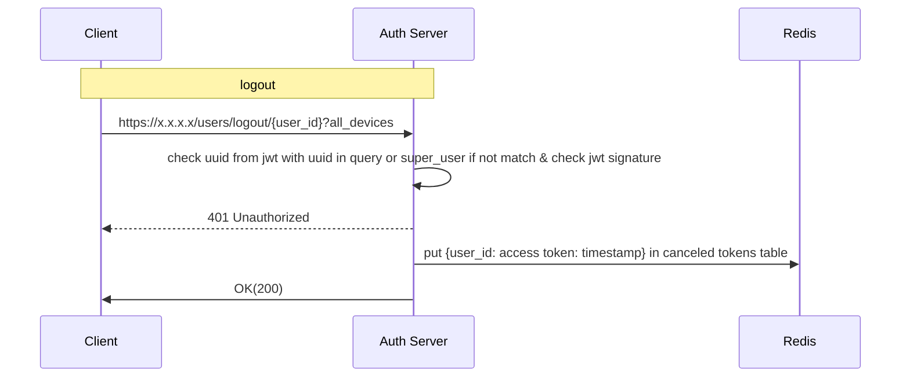

```mermaid
sequenceDiagram
    participant C as Client  
    participant S as Auth Server
    participant R as Redis

	Note over C, S: logout
	C->>S: https://x.x.x.x/users/logout/{user_id}?all_devices
	S->>S: check uuid from jwt with uuid in query or super_user if not match & check jwt signature
	S-->>C: 401 Unauthorized
	S->>R: put {user_id: access token: timestamp} in canceled tokens table
	S->>C: OK(200)
```

**Path**: /users/logout/{user_id}?all_devices=false
**Type**: Get  
**Header**: Authorization: Bearer {token}  
**Body**:
```
{
"Msg": "Success"
}
```
**Response Body**: None  