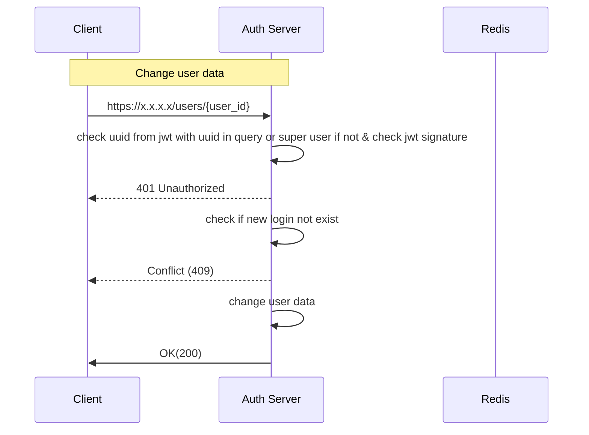

**Path**: /users/{user_id}  
**Type**: PUT  
**Header**: Authorization: Bearer {token}  
**Body**:
```
{
	"login": "",
	"password": ""
}  
```
**Response Body**:  
```
{
	"access_id": "access_token,
	"refresh_id": "refresh_token"
}  
```