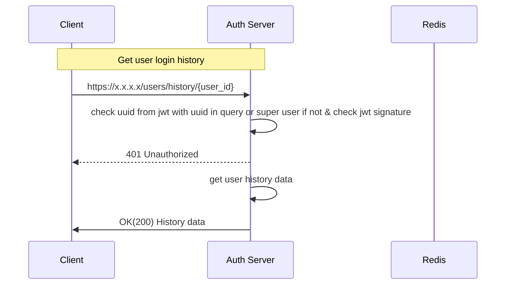

**Path**: /users/history/{user_id}?perpage_num=x&page_num=y  
**Type**: GET  
**Header**: Authorization: Bearer {token}  
**Body**: None  
**Response Body**:  
```
{
	"id": "",
	"user_id": "",
	"user_agent": "",
	"login_date": "",
	"login_status": ""
}  
```
