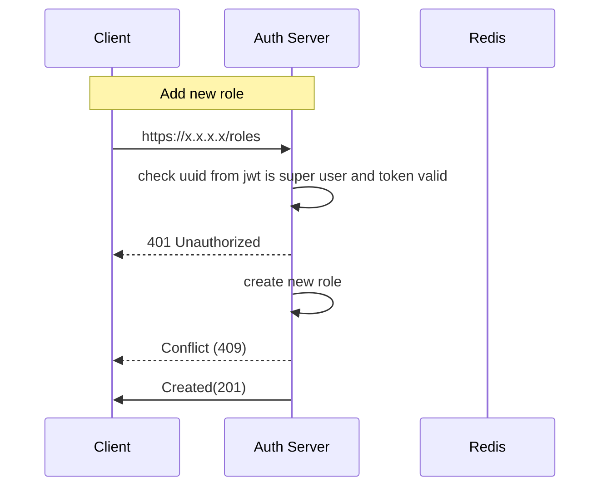

```mermaid
sequenceDiagram
    participant C as Client  
    participant S as Auth Server
    participant R as Redis

	Note over C, S: Add new role
	C->>S: https://x.x.x.x/roles
	S->>S: check uuid from jwt is super user and token valid
	S-->>C: 401 Unauthorized
	S->>S: create new role
	S-->>C: Conflict (409)
	S->>C: Created(201)

```

**Path**: /roles

**Type**: POST 
**Header**: Authorization: Bearer {token}  
**Body**:  
```
[{
"role": "role1",
"description": "desc"
}
]
```
**Response Body**:  
```
{
"Msg": "Success"
}
