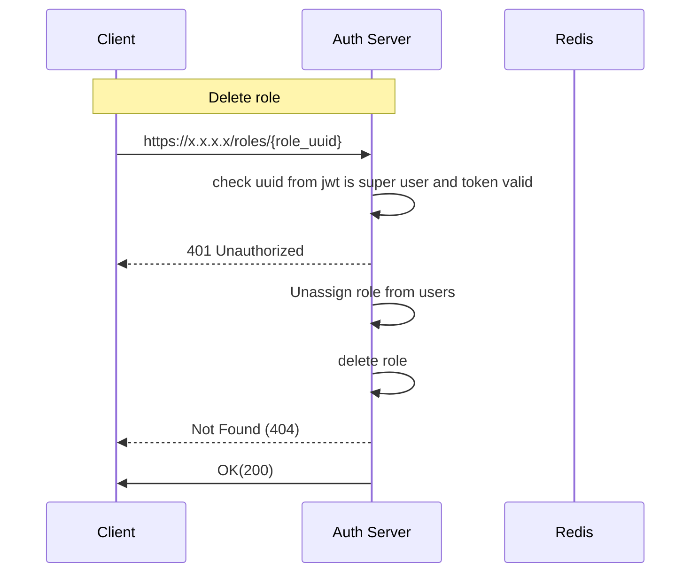

```mermaid
sequenceDiagram
    participant C as Client  
    participant S as Auth Server
    participant R as Redis

	Note over C, S: Delete role
	C->>S: https://x.x.x.x/roles/{role_uuid}
	S->>S: check uuid from jwt is super user and token valid
	S-->>C: 401 Unauthorized
	S->>S: Unassign role from users
	S->>S: delete role
	S-->>C: Not Found (404)
	S->>C: OK(200)

```

**Path**: /roles/{role_uuid}

**Type**: DELETE
**Header**: Authorization: Bearer {token}  
**Body**:  None
**Response Body**: 
```
{
"Msg": "Success"
}
