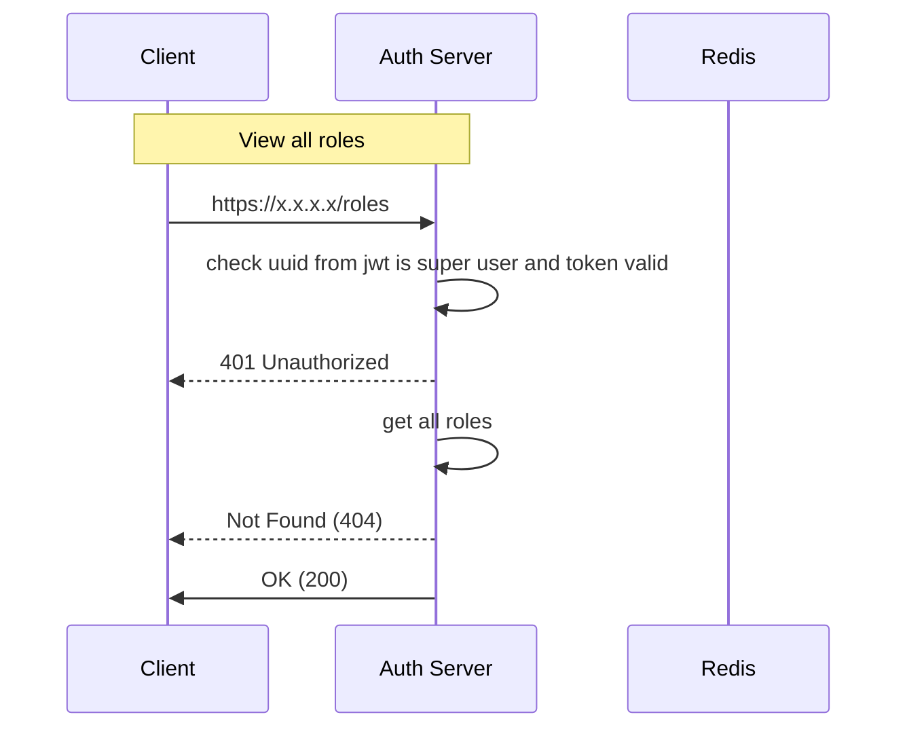

```mermaid
sequenceDiagram
    participant C as Client  
    participant S as Auth Server
    participant R as Redis

	Note over C, S: View all roles
	C->>S: https://x.x.x.x/roles
	S->>S: check uuid from jwt is super user and token valid
	S-->>C: 401 Unauthorized
	S->>S: get all roles
	S-->>C: Not Found (404)
	S->>C: OK (200)

```

**Path**: /roles

**Type**: GET
**Header**: Authorization: Bearer {token}  
**Body**:  None
**Response Body**:  
```
[
	{
		"id": "",
		"role": "",
		"description": ""
	}
] 
```
