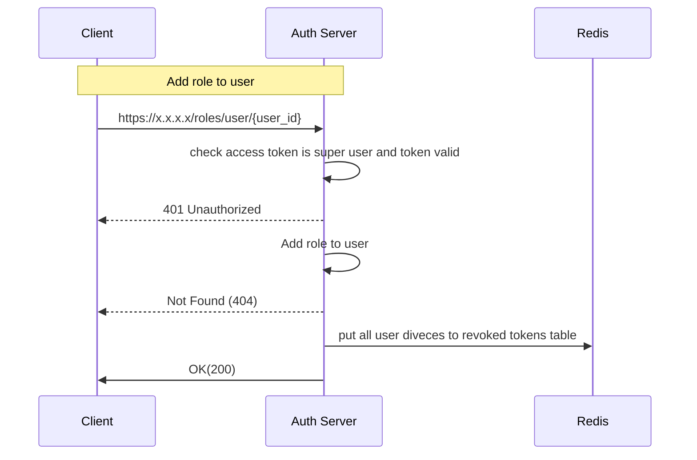

```mermaid
sequenceDiagram
    participant C as Client  
    participant S as Auth Server
    participant R as Redis

	Note over C, S: Add role to user
	C->>S: https://x.x.x.x/roles/user/{user_id}
	S->>S: check access token is super user and token valid
	S-->>C: 401 Unauthorized
	S->>S: Add role to user
	S-->>C: Not Found (404)
	S->>R: put all user diveces to revoked tokens table
	S->>C: OK(200)

```

**Path**: /roles/user/{user_id}

**Type**: POST
**Header**: Authorization: Bearer {token}  
**Body**: 
```
{
	"role_id": [1,2,3]
}
```
**Response Body**: 
```
{
"Msg": "Success"
}
```
