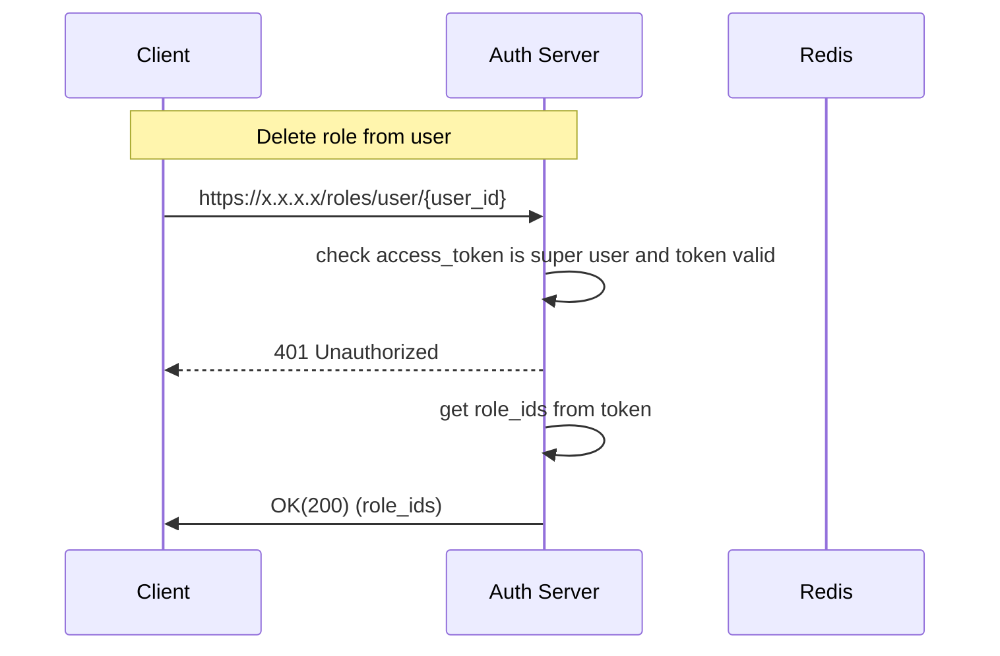

```mermaid
sequenceDiagram
    participant C as Client  
    participant S as Auth Server
    participant R as Redis

	Note over C, S: Delete role from user
	C->>S: https://x.x.x.x/roles/user/{user_id}
	S->>S: check access_token is super user and token valid
	S-->>C: 401 Unauthorized
	S->>S: get role_ids from token
	S->>C: OK(200) (role_ids)

```

**Path**: /roles/user/{user_id}

**Type**: GET
**Header**: Authorization: Bearer {token}  
**Body**: None
**Response Body**: 
```
{  
	"role_id": [1,2,3]
}  
```
