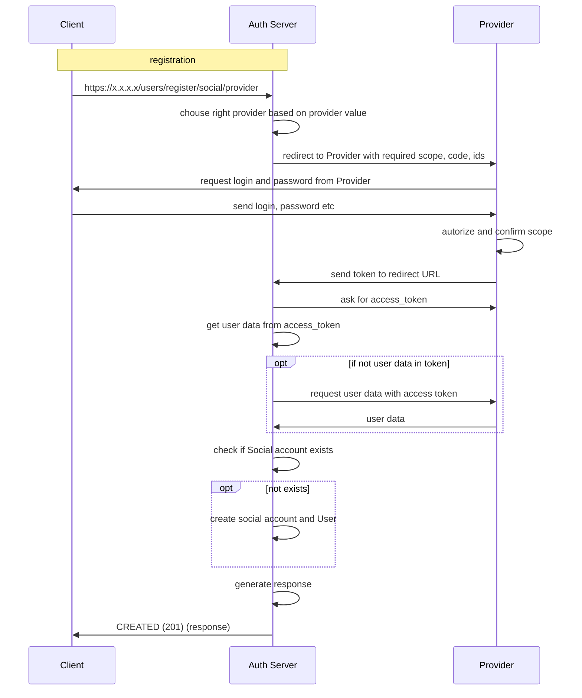

**Path**: /users/register/social/provider 
**Type**: Get  
**Body**: None  
**Response Body**
```
{
  "request_id": "string",
  "token": {
    "access_token": "string",
    "refresh_token": "string",
    "required_fields": [
      "string"
    ]
  },
  "totp_active": true
}  
```