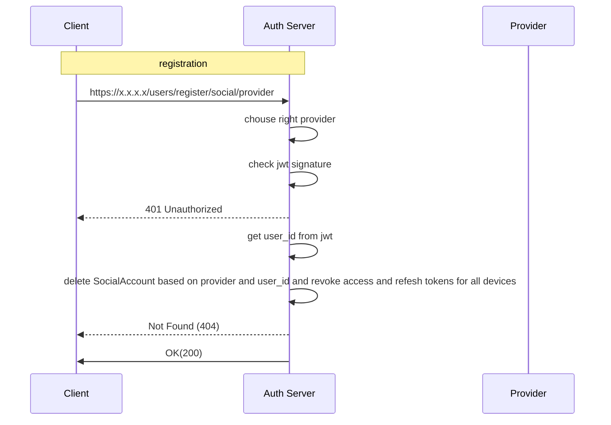

```mermaid
sequenceDiagram
	participant C as Client  
	participant S as Auth Server
	participant P as Provider
	Note over C, S: registration
	C->>S: https://x.x.x.x/users/register/social/provider
	S->>S: chouse right provider
	S->>S: check jwt signature
	S-->>C: 401 Unauthorized
	S->>S: get user_id from jwt
	S->>S: delete SocialAccount based on provider and user_id and revoke access and refesh tokens for all devices
	S-->>C: Not Found (404)
	S->>C: OK(200)
```

**Path**: /users/register/social/provider
**Type**: DELETE 
**Body**: None  
**Response Body**
```
{
"Msg": "Success"
}
