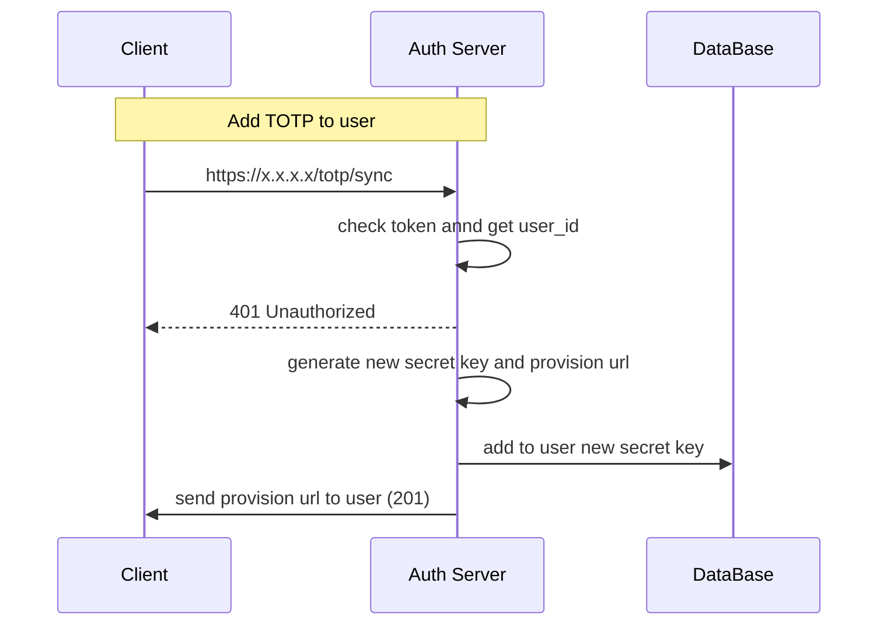
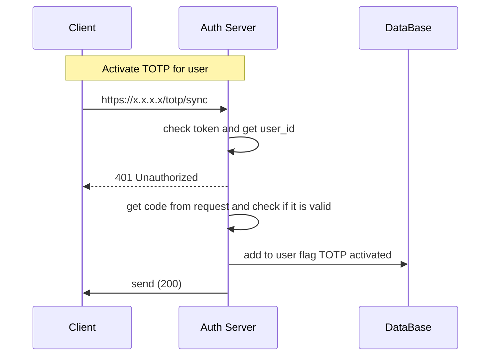
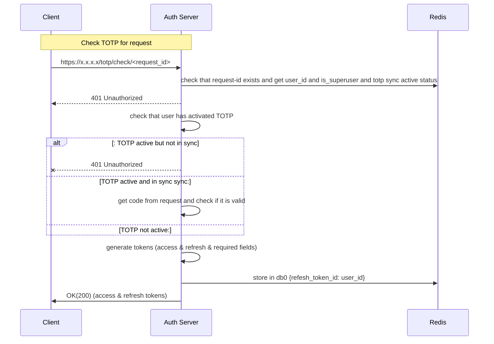

**Path**: /totp/sync
**Type**: GET
**Header**: Authorization: Bearer {token}  
**Body**: None
**Response Body**
```
{
"totp_provisioning_url": ""
}
```



**Path**: /totp/sync
**Type**: POST
**Header**: Authorization: Bearer {token}  
**Body**: 
```
{
    "code": ""
}
```
**Response Body**: None




**Path**: /totp/check/<request_id>
**Type**: POST
**Body**: 
```
{
    "code": ""
}
```
**Response Body**:
```
{
	"access_token": "access_token",
	"refresh_token": "refresh_token",
	"required_fields": [],
}  
```